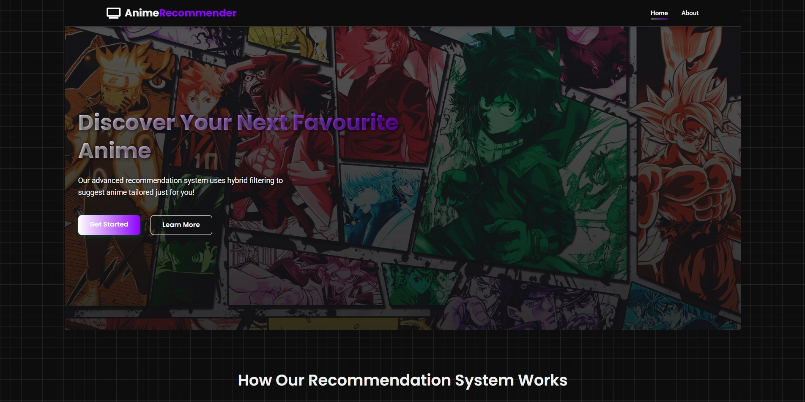
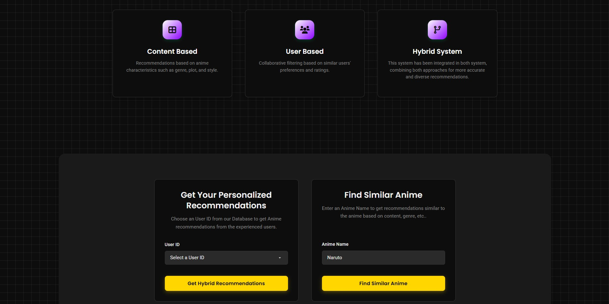
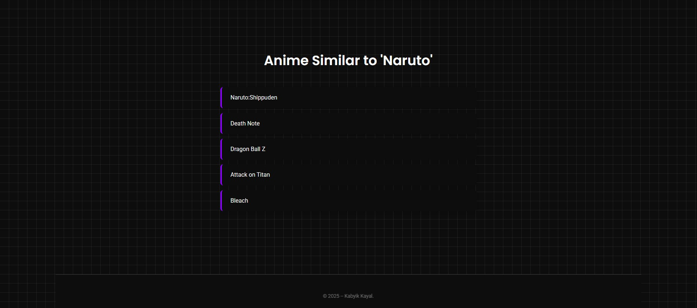

# Anime Recommendation Application

[](https://opensource.org/licenses/MIT)
[](https://www.python.org/downloads/)
<!-- Add other relevant badges here, e.g., Build Status, Code Coverage, Framework versions -->
<!-- [](<LINK_TO_JENKINS_JOB>) -->

**Live Demo:** [http://34.69.86.161/](http://34.69.86.161/) (*Note: This demo link might be inactive depending on when you are viewing this, If you are a recruiter just email/message on linkedin for the working demo.*)

---

## Table of Contents

1.  [Overview](#overview)
2.  [Features](#features)
3.  [Technology Stack](#technology-stack)
4.  [UI Preview](#ui-preview)
5.  [Architecture (High-Level)](#architecture-high-level)
6.  [Project Structure](#project-structure)
7.  [Data Flow & Management](#data-flow--management)
8.  [Model Details](#model-details)
9.  [Installation & Setup](#installation--setup)
10. [Configuration](#configuration)
11. [Running the Application Locally](#running-the-application-locally)
12. [CI/CD Pipeline (Jenkins)](#cicd-pipeline-jenkins)
13. [Deployment (GCP Kubernetes Engine)](#deployment-gcp-kubernetes-engine)
14. [Troubleshooting](#troubleshooting)
15. [Contributing](#contributing)
16. [License](#license)
17. [Acknowledgements](#acknowledgements)
18. [Contact](#contact)

---

## Overview

This project implements a sophisticated Anime Recommendation System designed to provide personalized anime suggestions. It employs a **hybrid recommendation strategy**, integrating both **content-based filtering** (analyzing anime attributes like genre and synopsis) and **user-based collaborative filtering** (analyzing similarities in user ratings and behavior). This approach aims to deliver recommendations that are both relevant and diverse.

The application features a Python/Flask backend serving the recommendation logic, a simple web frontend (HTML/CSS/JavaScript) for user interaction, and a complete MLOps pipeline for automation and scalability. The CI/CD process utilizes Jenkins for orchestration, Docker for containerization, DVC for data versioning, Google Container Registry (GCR) for storing Docker images, and Google Kubernetes Engine (GKE) for deployment. Experiment tracking is integrated using Comet ML.

---

## Features

*   **Hybrid Recommendations:** Leverages both content similarity and user behavior patterns for robust suggestions.
*   **Content-Based Input:** Recommends anime similar to a user-provided anime title by analyzing shared characteristics.
*   **(Future Scope) User-Based Input:** The architecture allows for extension to provide recommendations based on a specific User ID, requiring integration of user login and rating data.
*   **Web Interface:** An intuitive UI ([`templates/index.html`](./templates/index.html)) allows users to easily input an anime title and receive recommendations.
*   **Scalable Deployment:** Containerized using Docker ([`Dockerfile`](./Dockerfile)) and orchestrated with Kubernetes ([`deployment.yaml`](./deployment.yaml)) on GKE for high availability and scalability.
*   **Automated CI/CD:** A Jenkins pipeline ([`Jenkinsfile`](./Jenkinsfile)) automates the build, test (if implemented), data pulling, containerization, and deployment process upon code changes.
*   **Data & Model Versioning:** DVC is employed to manage large data files and ML model artifacts stored in the `artifacts/` directory, ensuring reproducibility.
*   **Experiment Tracking:** Training runs can be tracked using Comet ML, configured via Jenkins build arguments.

---

## Technology Stack

*   **Backend:** Python 3.8+, Flask
*   **Frontend:** HTML5, CSS3 ([`static/static.css`](./static/static.css)), JavaScript (Vanilla)
*   **Machine Learning:** TensorFlow/Keras, Scikit-learn, Pandas, NumPy, Joblib
*   **Data Storage & Versioning:** Google Cloud Storage (GCS), DVC
*   **CI/CD:** Jenkins ([`Jenkinsfile`](./Jenkinsfile)), Docker ([`Dockerfile`](./Dockerfile))
*   **Container Registry:** Google Container Registry (GCR)
*   **Deployment:** Google Kubernetes Engine (GKE) ([`deployment.yaml`](./deployment.yaml))
*   **Experiment Tracking:** Comet ML
*   **Environment Management:** `venv`

---

## UI Preview

The application features a web interface styled with CSS





---

## Architecture (High-Level)

*(Consider adding a visual architecture diagram here showing the flow from user request -> Flask App -> Helper Functions -> Model Artifacts -> Response, and the CI/CD flow separately)*

1.  **User Interaction:** User accesses the web UI, enters an anime name, and submits the form.
2.  **Frontend Request:** JavaScript sends an AJAX request to the Flask backend.
3.  **Flask Backend:** `app.py` receives the request.
4.  **Helper Functions:** `utils/helpers.py` is called to:
    *   Load necessary pre-processed data and model artifacts (embeddings, mappings) from the `artifacts/` directory.
    *   Find the input anime's representation (e.g., embedding vector).
    *   Calculate similarity scores with other anime based on the loaded model weights.
    *   Return a list of top N similar anime names.
5.  **Response:** Flask returns the recommendations as JSON to the frontend.
6.  **Frontend Display:** JavaScript dynamically updates the UI to display the recommendations.

---

## Project Structure

```
Anime-Recommendation-App/
├── artifacts/              # Stores processed data, models, weights (managed by DVC)
│   ├── model/              # Trained model files (e.g., model.h5, weights/*.pkl)
│   ├── model_checkpoints/  # Model checkpoints during training
│   ├── processed/          # Processed dataframes, encodings, splits (*.csv, *.pkl)
│   └── raw/                # Raw datasets (*.csv)
├── config/                 # Configuration files
│   ├── config.yaml         # Main config (GCS bucket, model params)
│   └── paths_config.py     # Defines paths for data and artifacts
├── custom_jenkins/         # Dockerfile for custom Jenkins agent (if used)
├── logs/                   # Application logs
├── notebooks/              # Jupyter notebooks for exploration, experimentation
├── pipeline/               # ML pipeline definitions (not core app logic)
│   ├── prediction_pipeline.py
│   └── training_pipeline.py
├── src/                    # Source code for ML components and utilities
│   ├── base_model.py       # Base model class/functions
│   ├── custom_exception.py # Custom exception handling
│   ├── data_ingestion.py   # Scripts for ingesting data
│   ├── data_processing.py  # Scripts for data cleaning and feature engineering
│   ├── logger.py           # Logging setup
│   └── model_training.py   # Script for training the model
├── static/                 # Static web assets
│   ├── static.css          # Main stylesheet
│   └── wallpaperflare.com_wallpaper.jpg # Background image
├── templates/              # Flask HTML templates
│   └── index.html          # Main page template
├── utils/                  # Utility functions for the Flask app
│   ├── common_functions.py # General utility functions (if any)
│   └── helpers.py          # Core logic for loading artifacts and making predictions
├── .dvc/                   # DVC internal files
├── .github/                # GitHub specific files (e.g., workflows - if used)
├── .gitignore              # Specifies intentionally untracked files
├── app.py                  # Flask application entry point
├── deployment.yaml         # Kubernetes deployment & service configuration
├── Dockerfile              # Defines the application's Docker image
├── Jenkinsfile             # Jenkins declarative pipeline script
├── LICENSE                 # Project license file (MIT)
├── README.md               # This file
├── requirements.txt        # Python package dependencies
├── setup.py                # Script for packaging the project (used for `pip install -e .`)
└── *.egg-info/             # Build metadata generated by setup.py
```

---

## Data Flow & Management

1.  **Source Data:** Raw datasets (`anime.csv`, `animelist.csv`, `anime_with_synopsis.csv`) are expected to reside in a Google Cloud Storage (GCS) bucket defined in [`config/config.yaml`](./config/config.yaml).
2.  **Ingestion:** The data ingestion process (potentially triggered manually or via a separate pipeline, using scripts like `src/data_ingestion.py`) downloads the raw data.
3.  **Processing:** Scripts like [`src/data_processing.py`](./src/data_processing.py) handle cleaning, merging, feature engineering (e.g., processing synopsis), and generating necessary mappings or encodings.
4.  **Artifact Storage:** Processed dataframes, mappings, encodings, and trained model files are saved to the `artifacts/` directory, organized into subfolders (`processed/`, `model/`). Paths are managed via [`config/paths_config.py`](./config/paths_config.py).
5.  **Versioning (DVC):** The contents of the `artifacts/` directory are version-controlled using DVC. `.dvc` files (e.g., `artifacts/processed.dvc`) track the data pointers stored in the configured DVC remote (likely GCS). The Jenkins pipeline uses `dvc pull` to retrieve the correct artifact versions needed for the application build.

---

## Model Details

*   **Type:** Hybrid Recommendation Model. It combines:
    *   **Content-Based:** Likely utilizes embeddings derived from anime metadata (genres, synopsis) to find items with similar characteristics.
    *   **Collaborative Filtering:** Employs embeddings learned from user-item interactions (ratings in `animelist.csv`) using a neural network approach (likely Keras/TensorFlow based on `model.h5` and `config.yaml`).
*   **Architecture:** The neural network probably consists of:
    *   Embedding layers for users and anime.
    *   Layers to combine these embeddings (e.g., dot product, concatenation followed by dense layers).
    *   An output layer predicting user ratings or interaction likelihood.
    *   Key hyperparameters (e.g., `embedding_size`, `loss`, `optimizer`) are defined in [`config/config.yaml`](./config/config.yaml).
*   **Training:** A dedicated training pipeline (e.g., `src/pipeline/training_pipeline.py` or `src/model_training.py`) uses the processed data from `artifacts/processed/` to train the model. Trained weights and potentially the model architecture (`model.h5`) are saved in `artifacts/model/`.
*   **Prediction:** For the "find similar anime" feature, the Flask app (`app.py`) uses [`utils/helpers.py`](./utils/helpers.py) to:
    *   Load the pre-trained anime embedding weights (`artifacts/model/weights/anime_weights.pkl`).
    *   Load necessary mappings (e.g., `anime2anime_encoded.pkl`, `anime2anime_decoded.pkl`) from `artifacts/processed/`.
    *   Find the embedding vector for the input anime.
    *   Calculate cosine similarity (or another distance metric) between the input anime's vector and all other anime vectors.
    *   Return the names of the most similar anime.

---

## Installation & Setup

Follow these steps to set up the project locally for development or running.

1.  **Prerequisites:**
    *   **Python:** Version 3.8 or higher. Verify with `python --version`.
    *   **Git:** Required for cloning the repository.
    *   **DVC:** Install DVC and the necessary remote dependencies (GCS in this case).
        ```bash
        pip install "dvc[gs]" # Or dvc[gdrive] if using Google Drive
        ```
    *   **(Optional) Google Cloud SDK:** Required if you need to interact with GCS directly or configure DVC credentials using `gcloud auth application-default login`.
    *   **(Optional) GCS Credentials:** Access credentials for the GCS bucket specified in `config/config.yaml` are needed to run data ingestion or pull DVC data. Configure via Application Default Credentials (ADC) or service account keys.

2.  **Clone Repository:**
    ```bash
    git clone https://github.com/Kabyik-Kayal/Anime-Recommendation-App.git
    cd Anime-Recommendation-App
    ```

3.  **Set up Virtual Environment:** (Recommended)
    ```bash
    python -m venv venv
    # On Windows
    .\venv\Scripts\activate
    # On macOS/Linux
    source venv/bin/activate
    ```

4.  **Install Dependencies:**
    ```bash
    pip install --upgrade pip
    pip install -r requirements.txt
    pip install -e . # Installs the project in editable mode using setup.py
    ```
    *Note: `-e .` allows you to modify the source code in `src/` and have the changes reflected without reinstalling.*

5.  **Configure DVC Remote (If necessary):**
    *   If this is the first time setting up or the remote isn't configured, you might need to point DVC to the GCS bucket.
        ```bash
        # Example: Replace 'your-gcs-bucket-name/dvcstore' with the actual path
        dvc remote modify origin url gs://mlops_project_bucket_2/dvcstore
        # You might need to add --local for project-specific config
        ```
    *   Ensure DVC can authenticate with GCS (e.g., via `gcloud auth application-default login` or setting `GOOGLE_APPLICATION_CREDENTIALS` environment variable).

6.  **Pull DVC Data:** Download the version-controlled data and model artifacts.
    ```bash
    dvc pull
    ```
    *   This command reads the `.dvc` files (like `artifacts/processed.dvc`) and downloads the corresponding data from the GCS remote into the `artifacts/` directory.
    *   *Note:* If you lack access to the original DVC remote/data, you would need to re-run the data processing and model training pipelines first.

---

## Configuration

*   **`config/config.yaml`:** Contains primary configurations:
    *   `data_ingestion`: Specifies the GCS bucket name and raw data filenames.
    *   `model`: Defines model hyperparameters like embedding size, loss function, optimizer, and evaluation metrics.
*   **`config/paths_config.py`:** Defines constants for file and directory paths used throughout the project, especially for locating artifacts. This promotes consistency and makes refactoring easier.
*   **Environment Variables:** The deployment process (Jenkins, Kubernetes) might rely on environment variables for sensitive information like GCP credentials (`GOOGLE_APPLICATION_CREDENTIALS`), Comet ML API keys, etc. These are typically injected during the CI/CD process or configured within the Kubernetes deployment.

---

## Running the Application Locally

1.  **Ensure Prerequisites:** Complete all steps in the [Installation & Setup](#installation--setup) section, including `dvc pull`.
2.  **Verify Artifacts:** Confirm that the necessary model artifacts (e.g., `.pkl`, `.h5` files specified in [`config/paths_config.py`](./config/paths_config.py) and loaded by [`utils/helpers.py`](./utils/helpers.py)) are present in the `artifacts/` directory.
3.  **Run Flask Development Server:**
    ```bash
    python app.py
    ```
4.  **Access Application:** Open your web browser and navigate to `http://127.0.0.1:5000` (or the address/port shown in the terminal output). You should see the web interface.

---

## CI/CD Pipeline (Jenkins)

The [`Jenkinsfile`](./Jenkinsfile) defines an automated pipeline executed by Jenkins to build, test, and deploy the application.

**Key Stages:**

1.  **Checkout:** Clones the latest source code from the GitHub repository.
2.  **Making a virtual environment:** Sets up a Python virtual environment (`venv`) and installs all required dependencies from `requirements.txt` and using `pip install -e .`.
3.  **Pulling DVC:** Executes `dvc pull` to download the necessary data and model artifacts tracked by DVC, ensuring the build uses the correct versions. Requires Jenkins agent to have DVC installed and GCS credentials configured.
4.  **Build & Push Docker Image:**
    *   Builds a Docker image using the instructions in the [`Dockerfile`](./Dockerfile). The application code and pulled artifacts are copied into the image.
    *   (Potentially) Injects build arguments like Comet ML API keys (`COMET_API_KEY`, `COMET_PROJECT_NAME`, `COMET_WORKSPACE`) into the Docker build process.
    *   Tags the built image (e.g., `gcr.io/${GCP_PROJECT}/anime-app:latest`).
    *   Pushes the tagged image to Google Container Registry (GCR). Requires Jenkins agent to be authenticated with GCR.
5.  **Deploying to Kubernetes:**
    *   Authenticates with Google Cloud Platform using service account credentials (`GOOGLE_APPLICATION_CREDENTIALS`).
    *   Sets the active GCP project (`gcloud config set project ${GCP_PROJECT}`).
    *   Connects `kubectl` to the target GKE cluster (`gcloud container clusters get-credentials anime-app-cluster --region us-central1`).
    *   Applies the Kubernetes configuration defined in [`deployment.yaml`](./deployment.yaml) using `kubectl apply -f deployment.yaml`. This tells Kubernetes to pull the newly pushed image from GCR and update the running application pods and service.

---

## Deployment (GCP Kubernetes Engine)

*   **Platform:** The application is designed for deployment on Google Kubernetes Engine (GKE).
*   **Configuration:** The [`deployment.yaml`](./deployment.yaml) file defines the necessary Kubernetes resources:
    *   **Deployment:** Specifies the desired state for the application, including the Docker image to use (pulled from GCR), the number of replicas (pods), container ports, and potentially environment variables or volume mounts.
    *   **Service:** Exposes the application pods to the network. Typically uses a `LoadBalancer` type service, which automatically provisions a Google Cloud Load Balancer with an external IP address to route traffic to the application pods.
*   **Automation:** The Jenkins CI/CD pipeline fully automates the deployment process to the `anime-app-cluster` GKE cluster within the specified GCP project (`carbide-datum-457415-j1` as per `Jenkinsfile`). Any push to the main branch (or configured trigger) will result in a new image build and deployment rollout.
*   **Access:** Once deployed, the application is accessible via the external IP address assigned to the LoadBalancer service. This IP is likely the one provided in the [Live Demo](#overview) link.

---

## Troubleshooting

*   **`dvc pull` fails:**
    *   Check DVC remote configuration (`dvc remote list`).
    *   Verify GCS bucket permissions and authentication (run `gcloud auth list`, check ADC or `GOOGLE_APPLICATION_CREDENTIALS`).
    *   Ensure the DVC cache directory has correct permissions.
*   **`pip install` errors:**
    *   Ensure you are using a compatible Python version (3.8+).
    *   Try upgrading pip (`pip install --upgrade pip`).
    *   Check for OS-specific dependencies that might be missing.
    *   Ensure the virtual environment is activated.
*   **`python app.py` fails:**
    *   Check that all dependencies installed correctly.
    *   Verify that `dvc pull` completed successfully and artifacts exist in `artifacts/`.
    *   Look at the Flask traceback and application logs (`logs/`) for specific error messages (e.g., `FileNotFoundError` if an artifact is missing, `KeyError` if data format is unexpected).
*   **Import Errors:**
    *   Ensure `pip install -e .` was run successfully after activating the virtual environment. This makes the `src` package importable.

---

## Contributing

Contributions are welcome! Please adhere to the following guidelines:

1.  **Fork & Branch:** Fork the repository and create a new branch for your feature or bug fix (`git checkout -b feature/your-feature-name` or `bugfix/issue-description`).
2.  **Code Style:** Follow standard Python conventions (PEP 8). Consider using linters/formatters like Flake8 or Black.
3.  **Commits:** Write clear, concise commit messages explaining the purpose of the change.
4.  **Testing:** Add unit tests or integration tests for new features or bug fixes (if a testing framework is set up).
5.  **Pull Request:** Create a Pull Request (PR) from your feature branch to the main repository's `main` branch. Provide a clear description of the changes in the PR.
6.  **Review:** Address any feedback or comments during the code review process.

---

## License

This project is licensed under the **MIT License**. See the [LICENSE](./LICENSE) file for details.

---

## Acknowledgements

*   Inspired by various recommendation system techniques and MLOps best practices.
*   Dataset sourced from Kaggle.

---

## Contact

For questions or feedback, please contact Kabyik Kayal